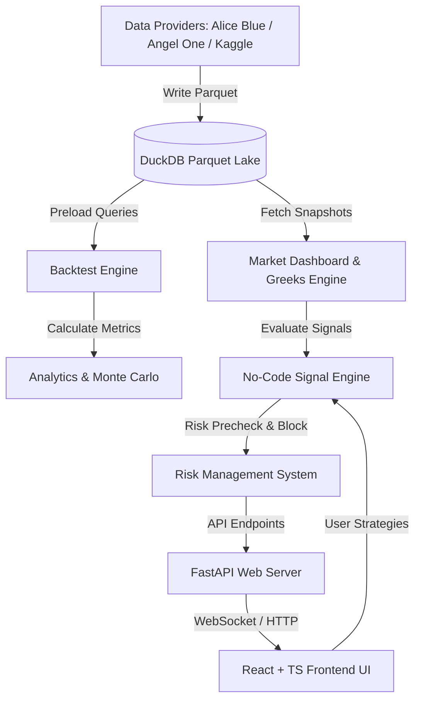

# Implemented Features & System Architecture Specification

This document provides a comprehensive, high-fidelity reference of all the features and systems currently implemented in the **Options Backtesting, Analytics & Risk Management Platform** (designed for Indian index/options markets such as NIFTY, BANKNIFTY, and FINNIFTY).

---

## 1. System Architecture

The platform is designed as an event-driven, high-performance backtesting and analytics suite utilizing a FastAPI backend, a React + TypeScript frontend, and a DuckDB + Parquet storage system.

---

## 2. Module-by-Module Implemented Features

### Module 1: Market Dashboard & Real-Time Analytics
* **Regime Detection**: Evaluates the intraday price against the daily VWAP and EMA9/21 crossovers to classify the current market into five regimes: `BULLISH_TREND`, `BEARISH_TREND`, `VOLATILE`, `LOW_VOLATILITY`, and `SIDEWAYS`.
* **Support & Resistance Engine**: Automatically calculates key support and resistance zones from the previous day's high/low, current day's high/low, maximum Put/Call OI levels (highest Open Interest strikes), and round-number psychological levels.
* **Option Chain Analytics & Greeks**: Generates a standard option chain grid calculating Black-Scholes Greeks (Delta, Theta, Gamma, Vega) and Implied Volatility (IV) on CE and PE sides, and computes aggregate metrics like Put-Call Ratio (PCR) and Max Pain.
* **OI Buildup Interpretation**: Classifies the price and Open Interest changes of option legs into four standard institutional indicators: `LONG_BUILDUP` (Bullish), `SHORT_BUILDUP` (Bearish), `SHORT_COVERING` (Bullish), and `LONG_UNWINDING` (Bearish).
* **Connecting Dots Confluence Matrix**: Computes time-bucketed (e.g., 3-minute or 5-minute) confluence trends using combined signals from price direction, PCR shifts, VWAP positioning, Supertrend crossovers, and RSI levels.
* **Market Alerts Engine**: Triggers alerts for real-time market events, including VWAP crossovers, day-high breakouts, and day-low breakdowns.
* **Live Streams**: Implements a unified stream manager that feeds live index tick updates and option chain snapshots using WebSocket polling or broker push connections.

* **Core Files**:
  * Backend Routes: [market.py](file:///v:/pers/Freelance/trading/api/routes/market.py) · [live_data.py](file:///v:/pers/Freelance/trading/api/routes/live_data.py) · [flow.py](file:///v:/pers/Freelance/trading/api/routes/flow.py)
  * Analytical Engines: [oi_interpret.py](file:///v:/pers/Freelance/trading/src/analysis/oi_interpret.py) · [connecting_dots.py](file:///v:/pers/Freelance/trading/src/analysis/connecting_dots.py) · [oi_tools.py](file:///v:/pers/Freelance/trading/src/analysis/oi_tools.py) · [oi_analysis.py](file:///v:/pers/Freelance/trading/src/analysis/oi_analysis.py)
  * Frontend Views: [Dashboard.tsx](file:///v:/pers/Freelance/trading/frontend/src/components/Dashboard.tsx) · [FlowMatrix.tsx](file:///v:/pers/Freelance/trading/frontend/src/components/FlowMatrix.tsx) · [OptionsChain.tsx](file:///v:/pers/Freelance/trading/frontend/src/components/OptionsChain.tsx) · [LiveTab.tsx](file:///v:/pers/Freelance/trading/frontend/src/components/LiveTab.tsx) · [ConnectingDots](file:///v:/pers/Freelance/trading/frontend/src/components/FlowMatrix.tsx)

---

### Module 2: No-Code Strategy Builder & Signalling
* **Ready-Made Templates**: Includes pre-configured templates for institutional options strategies:
  * *ATM Short Straddle* (Delta Neutral option selling)
  * *OTM Short Strangle* (Range-bound premium collection)
  * *Iron Condor* (Hedged option selling with defined risk)
  * *Bull Call Spread* & *Bear Put Spread* (Directional spread templates)
* **Leg Customization**: Supports configuring individual leg parameters: Buy/Sell action, CE/PE option types, strike selection logic (ATM offsets, Delta targets, Premium targets), and lot scaling.
* **Multi-Tier Filters**: Restricts entries based on weekday rules, PCR threshold bounds, synthetic IV Rank bands, VIX regimes, or technical indicators.
* **Quantman-Style Signal Engine**: Evaluates entry and exit conditions bar-by-bar, resolving complex nested logical structures (`AND`/`OR` groups) and detecting crossovers (`cross_above`/`cross_below`) on technical indicators.
* **Strategy CRUD**: Full persistence layer for saving, listing, updating, cloning, and deleting user-configured option strategies.
* **Strategy Validation Engine**: Scans strategy configurations for logical errors (e.g., negative risk values, missing legs, mismatched expiry times) and generates warnings for unprotected rules (e.g., no stop losses, naked option selling) prior to simulation.

* **Core Files**:
  * Backend Route & Specification: [strategies.py](file:///v:/pers/Freelance/trading/api/routes/strategies.py) · [strategy.py](file:///v:/pers/Freelance/trading/src/backtest/strategy.py)
  * Crossover Signal Engine: [signal_engine.py](file:///v:/pers/Freelance/trading/src/backtest/signal_engine.py)
  * Frontend Views: [StrategyBuilder.tsx](file:///v:/pers/Freelance/trading/frontend/src/components/StrategyBuilder.tsx) · [SignalBuilder.tsx](file:///v:/pers/Freelance/trading/frontend/src/components/SignalBuilder.tsx) · [LegBuilder.tsx](file:///v:/pers/Freelance/trading/frontend/src/components/LegBuilder.tsx) · [SavedStrategiesPanel.tsx](file:///v:/pers/Freelance/trading/frontend/src/components/SavedStrategiesPanel.tsx) · [StrategyValidationPanel.tsx](file:///v:/pers/Freelance/trading/frontend/src/components/StrategyValidationPanel.tsx)

---

### Module 3: Event-Driven Backtesting & Simulation
* **1-Minute Event Loop**: Simulates trades minute-by-minute throughout each trading day on spot and options historical data.
* **Bulk-Preload DB Optimization**: Replaces the inefficient $N+1$ query loop by loading the entire historical range of spot and options data in single optimized queries, partitioning the data in-memory before running the simulation.
* **Realistic Execution & Fills**: Aligns option legs on a unified grid, handles missing minutes via forward-filling, applies slippage models, and executes side-aware entry/exit fills.
* **Underlying-to-Premium Conversions**: Converts underlying index movement triggers (stop-losses, targets, trailing rules) to premium-point boundaries using Black-Scholes delta values ($\Delta P \approx |\delta| \times \Delta U$) when trading constraints are specified in underlying units.
* **Portfolio-Level Trailing**: Manages portfolio-wide exit boundaries, calculating total portfolio profit/loss percentage offsets from net premium bases.
* **Black-Scholes Fallback for Multi-Expiry Legs**: Evaluates far-month hedges in multi-expiry strategies using Black-Scholes pricing models when direct option chain ticks are absent on historical grids.
* **Parameter Sweeps**: Executes grid search sweeps across entry times and stop-loss steps to optimize straddle parameters.

* **Core Files**:
  * Core Engines: [engine.py](file:///v:/pers/Freelance/trading/src/backtest/engine.py) · [grid.py](file:///v:/pers/Freelance/trading/src/backtest/grid.py)
  * Backend Route: [backtest.py](file:///v:/pers/Freelance/trading/api/routes/backtest.py)
  * Frontend Views: [GridSweep.tsx](file:///v:/pers/Freelance/trading/frontend/src/components/GridSweep.tsx) · [ResultsPanel.tsx](file:///v:/pers/Freelance/trading/frontend/src/components/ResultsPanel.tsx) · [BacktestLoader.tsx](file:///v:/pers/Freelance/trading/frontend/src/components/BacktestLoader.tsx)

---

### Module 4: Performance Metrics & Analytics
* **Performance Metrics**: Calculates institutional performance stats: Expectancy, Win/Loss Rate, Net Profit/Loss, Average Win, Average Loss, Max Drawdown (MDD), and the Sharpe Ratio.
* **Monthly & Weekday Performance Distribution**: Summarizes profits/losses aggregated by calendar months and weekdays to expose cyclical strategy performance.
* **Drawdown Period Tracking**: Identifies historical peak-to-trough equity curves, documenting precise peak dates, valley dates, and durations.
* **Monte Carlo Simulation**: Runs 5,000 iterations of randomized historical trade sequences to estimate the 95% confidence worst-case drawdown, median P&L, and loss probability.
* **Overfitting / Curve-Fitting Warnings**: Logs diagnostic alerts if the strategy shows overfitting risk (e.g., small sample sizes, excessive indicator count to trade ratio, or high profit concentration in the top 3 trades).
* **Trade Log Export**: Generates and streams standard CSV files of detailed trade execution records.

* **Core Files**:
  * Metrics Calculator: [metrics.py](file:///v:/pers/Freelance/trading/src/backtest/metrics.py)
  * Analytics Endpoint: [backtest.py](file:///v:/pers/Freelance/trading/api/routes/backtest.py#L295-L437)
  * Frontend Analytics View: [ResultsPanel.tsx](file:///v:/pers/Freelance/trading/frontend/src/components/ResultsPanel.tsx)

---

### Module 5: Risk Management & Emergency Systems
* **Pre-Trade Risk Precheck**: Evaluates strategies before placement, computing a security risk score (from 2 to 10) and mapping it to a risk level (`LOW`, `MEDIUM`, `HIGH`, `VERY_HIGH`).
* **Hedge & Margin Estimation**: Dynamically calculates the estimated margin requirements for multi-leg structures, enforcing ₹150,000 margin for naked option sells and applying a 70% discount (hedge benefit) for hedged structures.
* **Trade Restrictor Rules**: Evaluates active account boundaries, automatically blocking entries when:
  * The strategy requires more capital than the user's allocated limit.
  * The day's accumulated losses exceed 3% of capital (Daily Loss Limit).
  * The day's total trade count reaches 10 trades.
  * An entry is requested within 300 seconds of a previous trade's exit (Cooldown Rule).
* **Emergency Kill Switch**: Immediately halts all system trade executions upon trigger and logs events to an audit trail.
* **Slippage Sensitivity Model**: Simulates the strategy's sensitivity, showing how Net PnL, Max Drawdown, and Profit Factor change under various slippage levels (0.0%, 1.0%, 3.0%, 5.0%, 10.0%).

* **Core Files**:
  * Backend Route: [risk.py](file:///v:/pers/Freelance/trading/api/routes/risk.py)
  * Frontend Components: [MarketAlertsPanel.tsx](file:///v:/pers/Freelance/trading/frontend/src/components/MarketAlertsPanel.tsx) · [TradeDrawer.tsx](file:///v:/pers/Freelance/trading/frontend/src/components/TradeDrawer.tsx) · [InstitutionalAnalytics.tsx](file:///v:/pers/Freelance/trading/frontend/src/components/InstitutionalAnalytics.tsx)

---

### Module 6: Option Pricing & Greeks Mathematical Layer
* **Black-Scholes Model**: Implements options pricing equations based on spot, strike, DTE, risk-free interest rates (default 6.5%), and volatility.
* **Implied Volatility (IV) Solver**: Solves for implied volatility from option market prices using numerical methods.
* **Greeks Engine**: Computes first and second-order Greeks:
  * **Delta ($\delta$)**: Option price sensitivity to underlying price movement.
  * **Gamma ($\gamma$)**: Delta sensitivity to underlying price movement.
  * **Theta ($\theta$)**: Option price decay per calendar day.
  * **Vega**: Option price sensitivity to changes in volatility.
* **Bid/Ask Spread Estimator**: Simulates bid and ask quotes using moneyness-based spreads for historical analyses.

* **Core Files**:
  * Math Libraries: [options_math.py](file:///v:/pers/Freelance/trading/src/data/options_math.py) · [greeks.py](file:///v:/pers/Freelance/trading/src/backtest/greeks.py)
  * Backend Payoff Endpoint: [payoff.py](file:///v:/pers/Freelance/trading/api/routes/payoff.py)
  * Frontend Graph Component: [OptionsChain.tsx](file:///v:/pers/Freelance/trading/frontend/src/components/OptionsChain.tsx)

---

### Module 7: Historical Data Storage & Loader
* **Partitioned Parquet Data Lake**: Stores high-resolution historical data using hive-partitioned directories.
  * Spot Path: `data/lake/spot/underlying={SYMBOL}/`
  * Options Path: `data/lake/options/underlying={SYMBOL}/expiry={DATE}/`
* **DuckDB Analytical Engine**: Queries raw Parquet directories directly using DuckDB, ensuring sub-second response times on millions of rows.
* **Multiple Data Loaders**:
  * **Kaggle Importer**: Backfills free high-quality historical candles.
  * **Yahoo Finance Loader**: Downloads index spot prices.
  * **Alice Blue pya3 client**: Backfills historical contracts and logs authentication.
  * **Angel One smartapi client**: Connects live streaming feeds and tracks scrip indices.
* **Date-Aware Lot Size Engine**: Automatically returns accurate contract lot sizes based on trading dates (e.g., mapping lot sizes before and after the NSE lot revisions on January 1, 2026).

* **Core Files**:
  * Database & Schemas: [storage.py](file:///v:/pers/Freelance/trading/src/data/storage.py) · [schema.py](file:///v:/pers/Freelance/trading/src/data/schema.py)
  * Data Integration Clients: [aliceblue_client.py](file:///v:/pers/Freelance/trading/src/data/aliceblue_client.py) · [angelone_client.py](file:///v:/pers/Freelance/trading/src/data/angelone_client.py) · [kaggle_loader.py](file:///v:/pers/Freelance/trading/src/data/kaggle_loader.py) · [yahoo_loader.py](file:///v:/pers/Freelance/trading/src/data/yahoo_loader.py)
  * Authentication: [oauth.py](file:///v:/pers/Freelance/trading/api/routes/oauth.py)

---

### Module 8: Participant-Wise (FII/DII) Activity Tracker
* **Institutional Positioning**: Compiles daily net buy/sell values and derivatives positioning (contracts long/short) across participant categories:
  * **FII**: Foreign Institutional Investors
  * **DII**: Domestic Institutional Investors
  * **Pro**: Proprietary Trading Desks
  * **Client**: Retail Traders
* **Trend Analysis**: Groups participant activity chronologically to expose institutional direction biases.

* **Core Files**:
  * Backend Route: [fii_dii.py](file:///v:/pers/Freelance/trading/api/routes/fii_dii.py)
  * Database Query Utility: [storage.py](file:///v:/pers/Freelance/trading/src/data/storage.py#L295-L330)

---

## 3. Implemented Technical Indicator Library

The system implements the following indicators within the signal and validation engines, maintaining exact calculation parity with TradingView standards:

| Indicator | Code Function | Key Outputs | Description & Usage |
| :--- | :--- | :--- | :--- |
| **SMA** | `compute_sma` | `value` | Simple Moving Average calculated over a period. |
| **EMA** | `compute_ema` | `value` | Exponential Moving Average using smoothing multipliers. |
| **RSI** | `compute_rsi` | `value` | Relative Strength Index (period 14) to flag overbought/oversold levels. |
| **ATR** | `compute_atr` | `value` | Average True Range tracking market volatility. |
| **Supertrend** | `compute_supertrend` | `line`, `dir` | Trend-following indicator mapping buy/sell direction based on ATR offsets. |
| **MACD** | `compute_macd` | `macd`, `signal`, `hist` | Moving Average Convergence Divergence tracking fast/slow EMA signals. |
| **Bollinger Bands** | `compute_bollinger` | `upper`, `mid`, `lower` | Volatility bands calculated standard deviations away from the mid SMA. |
| **VWAP** | `compute_vwap` | `value` | Volume Weighted Average Price resetting daily. |
| **Opening Range Breakout** | `_range_breakout` | `hi`, `lo` | Captures high/low boundaries inside an opening time window (e.g. 09:15-09:30). |

* **Core File**: [indicators.py](file:///v:/pers/Freelance/trading/src/backtest/indicators.py)

---

## 4. NSE Option statutory Cost parameters

Taxes, duties, and execution costs are computed dynamically per leg per transaction using side-aware parameters:

* **Brokerage**: ₹20.0 flat per order (standard flat rate).
* **Securities Transaction Tax (STT)**: 0.10% applied strictly on the **SELL** side premium.
* **Exchange Transaction Charge (NSE)**: 0.035% of the traded premium value.
* **SEBI Turnover Fee**: 0.0001% of the traded premium value.
* **Stamp Duty**: 0.003% applied strictly on the **BUY** side premium value.
* **GST**: 18.0% applied on the sum of Brokerage and Exchange Transaction Charges.
* **Slippage Adjuster**: Optional percentage penalty applied directly to entry/exit fill execution prices.

* **Core File**: [costs.py](file:///v:/pers/Freelance/trading/src/backtest/costs.py)

---

## 5. React Frontend Components Registry

The user interface uses modular React components powered by Tailwind CSS, recharts, and Lightweight Charts:

| Component | File Path | Primary Visual / Interaction Duty |
| :--- | :--- | :--- |
| **Dashboard** | [Dashboard.tsx](file:///v:/pers/Freelance/trading/frontend/src/components/Dashboard.tsx) | Live market index tickers, regime display, and support/resistance summaries. |
| **Strategy Builder** | [StrategyBuilder.tsx](file:///v:/pers/Freelance/trading/frontend/src/components/StrategyBuilder.tsx) | Assembly canvas, template picker, and leg control workspace. |
| **Signal Builder** | [SignalBuilder.tsx](file:///v:/pers/Freelance/trading/frontend/src/components/SignalBuilder.tsx) | Nested rule assembler supporting conditional and crossover queries. |
| **Entry Conditions** | [EntryConditions.tsx](file:///v:/pers/Freelance/trading/frontend/src/components/EntryConditions.tsx) | Configuration panel for weekdays, times, PCR limits, IV rank, and indicator filters. |
| **Exit Conditions** | [ExitConditions.tsx](file:///v:/pers/Freelance/trading/frontend/src/components/ExitConditions.tsx) | Panel for setting portfolio-wide profit targets, stop losses, and trailing triggers. |
| **Results Panel** | [ResultsPanel.tsx](file:///v:/pers/Freelance/trading/frontend/src/components/ResultsPanel.tsx) | Backtest stats summary, monthly grids, drawdown periods, and Monte Carlo curves. |
| **Options Chain** | [OptionsChain.tsx](file:///v:/pers/Freelance/trading/frontend/src/components/OptionsChain.tsx) | Multi-row options grid showing Greeks and an interactive payoff curve. |
| **Flow Matrix** | [FlowMatrix.tsx](file:///v:/pers/Freelance/trading/frontend/src/components/FlowMatrix.tsx) | Visual dashboard containing Connecting Dots, OI analysis tables, and live flows. |
| **Lightweight Chart** | [LWChart.tsx](file:///v:/pers/Freelance/trading/frontend/src/components/LWChart.tsx) | Interactive candlestick chart with overlays for support/resistance levels. |
| **Grid Sweep Panel** | [GridSweep.tsx](file:///v:/pers/Freelance/trading/frontend/src/components/GridSweep.tsx) | Parametric sweep layout showing optimal backtest configurations. |
| **Live Tab View** | [LiveTab.tsx](file:///v:/pers/Freelance/trading/frontend/src/components/LiveTab.tsx) | Simple panel for real-time spot LTP and ATM contracts. |
| **Trade Drawer** | [TradeDrawer.tsx](file:///v:/pers/Freelance/trading/frontend/src/components/TradeDrawer.tsx) | Overlay listing live position parameters and risk score warnings. |
| **Institutional Analytics** | [InstitutionalAnalytics.tsx](file:///v:/pers/Freelance/trading/frontend/src/components/InstitutionalAnalytics.tsx) | Audit trail console, kill switch panel, and live streaming metrics. |
